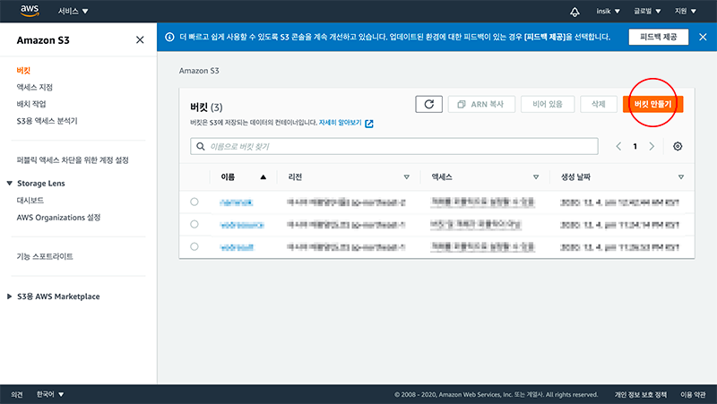

동영상을 스트리밍 할 수 있는 방법론은 다양하다.

본 블로그에서는 **동영상을 HLS로 인코딩하고 그 파일을 AWS의 S3에 업로드하여 CloudFront에 배포되고 Javascript를 이용해서 사용자의 웹브라우져에서 스트리밍** 하는 방식에 대해서 설명 하고자 한다. 각 용어의 뜻은 다음과 같다.

- AWS S3 : 파일 저장 공간
- AWS CloudFront : CDN 방식을 사용
- HLS : 스트리밍용 영상 파일이다. 애플이 제작
- Video.js : 애플기기 외에 플레이 안되는 기기들이 있어서 이 비디오 플레이어 프레임워크를 써야한다.

## 1. S3 구성하기 하고 영상 업로드 하기

먼저 [AWS S3](https://s3.console.aws.amazon.com/s3/home?region=ap-northeast-2) 접속 하여 왼쪽 메뉴에서 버킷 선택 후, 그리고 우측 상단의 `버킷 만들기` 클릭

버킷 이름 입력, 모든 퍼블릭 액세스 차단 해제  하고 하단의 `버킷 만들기` 클릭

파일들을 선택하고 모든 사람 객체 `읽기`에 체크한다. (HLS 영상은 .ts 파일과 인덱스 파일인 .m3u 파일로 존재하며 이 부분 AWS에서 인코딩하거나 여러 인코더들로 변환하면 된다.)

## 2. CloudFront 구성하고 배포 설정하기

AWS [Cloudfront]([https://console.aws.amazon.com/cloudfront/home?region=ap-northeast-2](https://console.aws.amazon.com/cloudfront/home?region=ap-northeast-2))로 접속해서 왼쪽 메뉴에서 `Distributions` 클릭 - 본문의 `Create Distribution` 선택

Web 의 `Get Started` 버튼을 누른다.

RTMP 는 2021년부터 배포를 지원하지 않는다. 그리고 HLS는 Web 방식이다.

다음과 같이 설정 한다.

- **Origin Domain Name** : 셀렉트 박스이며 아까 S3에서 만든 버킷을 선택하면 된다.

- **Restrict Bucket Access** : yes 선택

- **Origin Access Identity** : Create a New Identity 선택

    (Restrict Bucket Access - yes 선택하면 보임)

- **Comment** : 자동 입력된 값 그냥 두면 됨

    (Restrict Bucket Access - yes 선택하면 보임)

- **Grant Read Permissions on Bucket** : Yes, Update Bucket Policy 선택

- **Cache and origin request settings** : Use legacy cache settings 선택

- **Cache Based on Selected Request Headers** : Whitelist 선택

    Cache and origin request settings - Use legacy cache settings 선택하면 보임

- **Whitelist Headers** 왼쪽 박스에서

    `Access-Control-Request-Headers`

    `Access-Control-Request-Method`,

    `Origin`을 선택하고 `Add >>` 를 눌러 우측 박스로 이동 시킨다.

- 그 외에는 기본값으로 두고 맨 밑에 `Create Distribution` 을 누른다.

다시 왼쪽의 메뉴의 `Distributions`을 눌러 이동하자

이제 CDN으로 배포될 준비가 되었다. Domain Name이라고 있는 곳의 주소를 기억했다가 나중에 영상 주소 넣을 때 사용한다. (ex, d2aqi1xc06ycq4.cloudfront.net)

- 아까 생성한 S3의 영상 파일들을 배포하고 있는 중이다.
- 완료되면 `In Progress`가 `Deployed`라고 바뀐다.

## 3. 영상 재생 웹페이지 생성

- HLS 는 apple 기기 위주로 만든 방식이라 크롬에서 재생 불가
- 그래서 AWS 에서는 Video.js , Google Shaka Player, hls.js 를 활용 필요([https://docs.aws.amazon.com/ko_kr/kinesisvideostreams/latest/dg/hls-playback.html](https://docs.aws.amazon.com/ko_kr/kinesisvideostreams/latest/dg/hls-playback.html))
- 여기서는 Video.js 를 사용해서 개발할 예정이다. 해당 파일은 CDN으로 불러와 넣는다.([https://videojs.com/getting-started](https://videojs.com/getting-started))
- Video.js에 HLS 재생을 위해 추가 확장 파일을 추가한다. 해당 파일 역시 CDN으로 불러와 넣는다.([https://videojs.github.io/videojs-contrib-hls/](https://videojs.github.io/videojs-contrib-hls/))

source src에만 아까 만든 cloudFront 페이지의 도메인 네임 + 파일명을 조합해서 영상 파일의 인덱스 파일인 m3u8을 수정해서 넣으면 된다.


<!doctype html>
<html lang="en">
<head>
    <meta charset="UTF-8">
    <meta name="viewport"
          content="width=device-width, user-scalable=no, initial-scale=1.0, maximum-scale=1.0, minimum-scale=1.0">
    <meta http-equiv="X-UA-Compatible" content="ie=edge">
    <title>lab.naminsik.com</title>
    <link href="https://vjs.zencdn.net/7.10.2/video-js.css" rel="stylesheet" />
    
</head>
<body>
<video id=video width=100% class="video-js" controls>
    <source src="https://d2aqi1xc06ycq4.cloudfront.net/파일명.m3u8" type="application/x-mpegURL">
</video>

</body>
</html>


하지만 크롬에서는 재생이 되지 않고 아래처럼 console 에서 오류 로그를 확인할 수 있다.

- S3와 cloudFront에 CORS 셋팅이 안되어 있어서 그렇다.

 

## 4. CORS 설정하기

S3로 돌아가서 만든 버킷으로 들어가서 `권한`탭을 선택 후 밑에 `CORS(Cross-origin 리소스 공유)` 를 찾아 `편집` 버튼을 누른다.

다음과 같이 CORS를 입력하고 저장을 한다.


[
    {
        "AllowedHeaders": [
            "*"
        ],
        "AllowedMethods": [
            "PUT",
            "POST",
            "GET"
        ],
        "AllowedOrigins": [
            "*"
        ],
        "ExposeHeaders": [],
        "MaxAgeSeconds": 3000
    }
]


그리고 다시 돌아온 버킷의 `권한`탭에서 `버킷 정책`을 보면 위 진행 과정 중에 Discribution 만들 때 " Comment : 자동 입력된 값 그냥 두면 됨 " 라고 했었기 때문에 자동으로 입력된 값이 보일 것이다.

버킷 정책값이 없거나 바뀌었다고 생각하면 다시 수정하면 된다. 수정하는 과정은 다음과 같다.

- CloudFront 의 Origin access identity 로 이동한다.
- 아까 Discribution 만들 때 " **Comment** : 자동 입력된 값 그냥 두면 됨 " 라고 한 곳에 들어있던 자동 입력 Comment 값이 목록에 보일 것이다.
- 그 Comment 의 Amazon S3 Canonical User ID 값을 복사한다.
- 다시 S3 의 버킷으로 돌아가서 `권한`탭의 `버킷 정책`을 `편집`을 눌러 아래 내용으로 수정한다.

`변경 사항 저장`을 누르면 "CanonicalUser" 의 키와 값이 저장되고 나면 "AWS": "arn:aws:iam::cloudfront:user/CloudFront Origin Access Identity E16TH420ZUON0B" 이런 식으로 변경되어 반영되어 진다.


{
    "Version": "2008-10-17",
    "Id": "PolicyForCloudFrontPrivateContent",
    "Statement": [
        {
            "Sid": "1",
            "Effect": "Allow",
            "Principal": {
                 "CanonicalUser": "바로 위에서 복사한 Amazon S3 Canonical User ID"
            },
            "Action": "s3:GetObject",
            "Resource": "arn:aws:s3:::testuploadvod/*"
        }
    ]
}


이제 cloudFront의 Distributions 으로 이동한다. 체크 박스를 선택하고 `Distribution Settings` 를 누르거나 바로 Distribusion의 ID를 클릭해서 해당 Distribution 상세 페이지로 이동한다.

상단의 `Behaviors` 탭을 클릭하고 체크박스로 선택 후 `Edit`를 눌러 수정 페이지로 진입한다.

- **Allowed HTTP Methods** : GET, HEAD, OPTIONS
- **Cached HTTP Methods** : GET, HEAD (Cached by default) OPTIONS 에 체크
- 다 완료하였으면 우측 하단에 있는 `**Yes, Edit**` 을 눌러 완료한다

- 수정이 완료되면 다시 배포를 시작한다.
- 배포가 완료되면 Status에 `In Progress`가 `Deployed`라고 바뀐다.

## Reference
- [동영상 스트리밍 서비스 구축 1장 (AWS s3/cloudFront, HLS, video.js)](http://lab.naminsik.com/3960)
